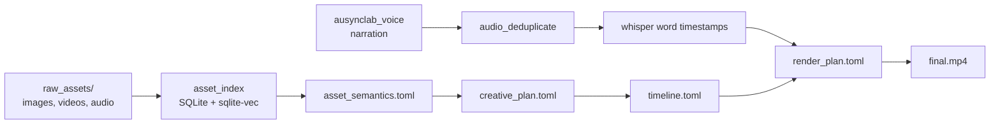

# video-automator-skills

> Kho kỹ năng (skills) để xây pipeline sản xuất video ngắn bằng agent: lập kế hoạch, xử lý audio, ánh xạ asset, dựng timeline và render.

Tài liệu đầy đủ: **https://vas.mintlify.app/**

## Pipeline

## Cài đặt nhanh

**macOS / Windows** — double-click [`setup/Install.command`](setup/Install.command) hoặc [`setup/Install.bat`](setup/Install.bat). Installer tự kiểm tra Python 3.10+, ffmpeg, mở trình duyệt để bạn lấy OpenAI + Gemini key, rồi đăng ký watcher chạy nền.

**Cần tính năng** (Render video, tạo giọng đọc AI) → đọc [Cài đặt đầy đủ](https://vas.mintlify.app/installation/linux).

## Skills

- `$audio-deduplicate` — bỏ đoạn nói trùng lặp/restart/vấp trong file ghi âm. [Chi tiết](https://vas.mintlify.app/skills/audio-deduplicate).

(Sẽ bổ sung thêm skill khác sau.)

## Tài liệu

- [Bắt đầu nhanh](https://vas.mintlify.app/quickstart)
- [Cài đặt đầy đủ (macOS / Windows / Linux)](https://vas.mintlify.app/installation/macos)
- [Cấu hình API keys](https://vas.mintlify.app/configuration/env)
- [Asset Index nâng cao](https://vas.mintlify.app/asset-index/architecture)
- [Khắc phục sự cố](https://vas.mintlify.app/troubleshooting)

## Đóng góp

Đóng góp được hoan nghênh. Đọc [CONTRIBUTING.md](CONTRIBUTING.md) hoặc [hướng dẫn online](https://vas.mintlify.app/contributing) để biết cách báo bug, đề xuất feature, hoặc viết skill mới.

## License

**PolyForm Noncommercial 1.0.0** — sử dụng cá nhân, học tập, nghiên cứu OK. Mọi mục đích thương mại cần xin phép tác giả ([@bachdyon](https://github.com/bachdyon)). Xem toàn văn: [LICENSE](LICENSE).
